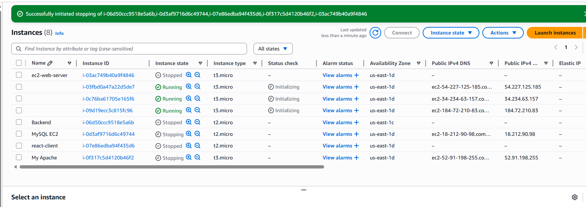
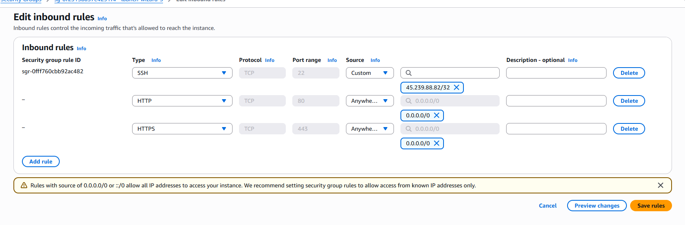
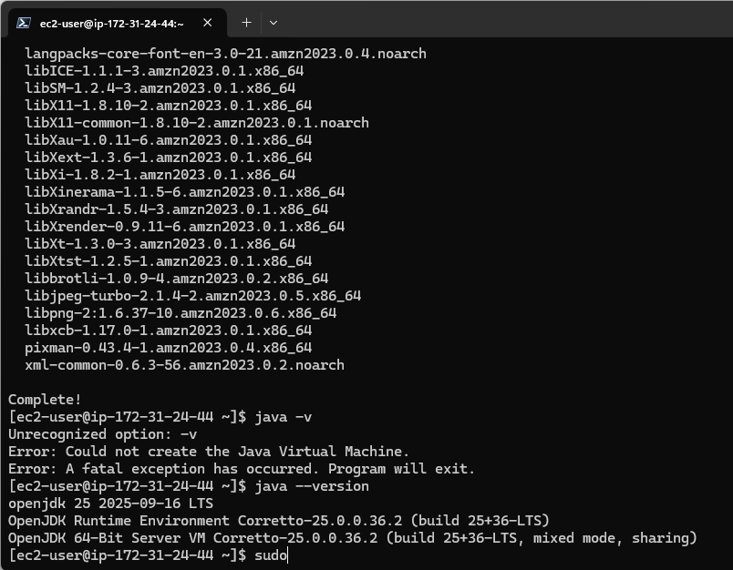
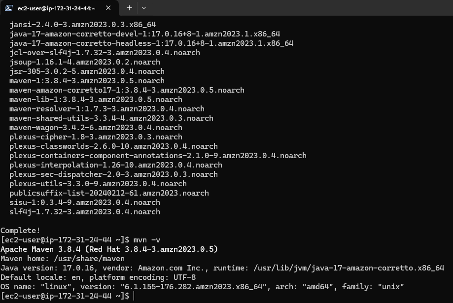

# AREP-Exam-T2
AREP T2 Exam

## Miguel Angel Motta

### Usage


### Testing Cient


## Deploying in AWS
### Configuration



### Set up EC2
````shell
sudo yum install java -y
sudo yum install maven -y
yum install git -y
git clone https://github.com/MIGUEL-MOTTA-U/AREP-Exam-T2
cd ./AREP-Exam-T2
mvn clean package
mvn spring-boot:run
````




