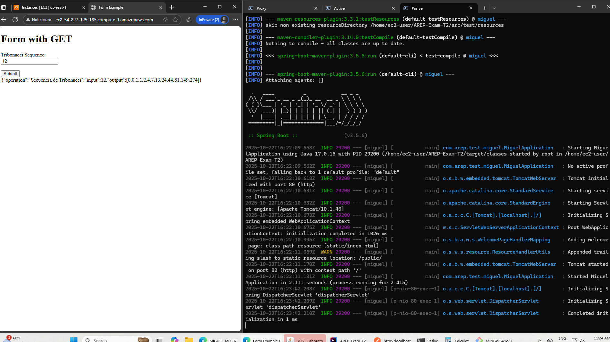

# AREP-Exam-T2
AREP T2 Exam

## Miguel Angel Motta

### Usage


### Testing Cient


## Deploying in AWS
### Configuration


### Set up EC2
````shell
sudo yum install java -y
sudo yum install maven -y
yum install git -y
git clone https://github.com/MIGUEL-MOTTA-U/AREP-Exam-T2
cd ./AREP-Exam-T2 # I must specify if the server is proxy, by default it's not
mvn clean package
mvn spring-boot:run
````


Finally, I've to set up the proxy server with the deployed instances urls and declare the attribute as true (because it's not proxy by default):

### Testing
The proxy runs the application and the two servers:


It handled through the active server:


It handled through the passive server because I stopped the active server:
